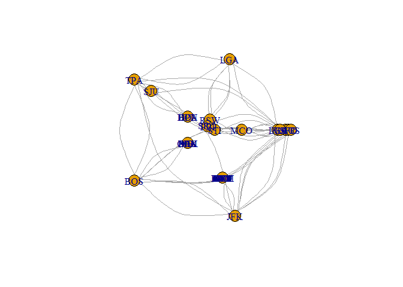

<!-- README.md is generated from README.Rmd. Please edit that file -->
[](https://travis-ci.org/jaredlander/HivePlot)

Steps to take
=============

1.  Turn edgelist into graph
2.  Determine number of axes based on number of clusters (or other option)
3.  Determine size based on a measure, page rank to start
4.  Determine position based on closeness or other measure
5.  Plot these coordinates

Example code
============

``` r
library(igraph)
#> 
#> Attaching package: 'igraph'
#> 
#> The following objects are masked from 'package:stats':
#> 
#>     decompose, spectrum
#> 
#> The following object is masked from 'package:base':
#> 
#>     union
library(dplyr)
#> 
#> Attaching package: 'dplyr'
#> 
#> The following objects are masked from 'package:igraph':
#> 
#>     %>%, as_data_frame, groups, union
#> 
#> The following objects are masked from 'package:stats':
#> 
#>     filter, lag
#> 
#> The following objects are masked from 'package:base':
#> 
#>     intersect, setdiff, setequal, union
library(magrittr)
#> 
#> Attaching package: 'magrittr'
#> 
#> The following object is masked from 'package:igraph':
#> 
#>     %>%
library(HivePlot)
```

``` r
# load data
data(flights)
head(flights)
#>   Origin Destination Price
#> 1    JFK         TPA   370
#> 2    EWR         TPA   360
#> 3    LGA         TPA   350
#> 4    TPA         BOS   290
#> 5    TPA         DCA   150
#> 6    TPA         BDL   450
```

``` r
# turn into a graph
g <- graph.data.frame(flights, directed=FALSE)
```

``` r
# Perform clustering to determine number of axes
# it defaults to walktrap.community but any function that returns a clustering should work
g %<>% findAxes
V(g)$axis
#>  [1] 5 1 2 3 5 5 5 5 4 5 1 5 1 5 5 5 5 2 2 2 1 3 1 1 1 3 3 3 5 4 4 4 4 4
```

``` r
# calculate the size of the nodes, defaulting to page.rank
g %<>% nodeSize
V(g)$nodeSize
#>  [1] 0.17261796 0.06717003 0.05299778 0.08182872 0.01358209 0.01358209
#>  [7] 0.01358209 0.01358209 0.10145459 0.01358209 0.04615916 0.01358209
#> [13] 0.02920346 0.01358209 0.01358209 0.01358209 0.01358209 0.01342139
#> [19] 0.02157775 0.01342139 0.03719911 0.02126243 0.02034243 0.01256813
#> [25] 0.05487745 0.01310607 0.01310607 0.01310607 0.01358209 0.01303540
#> [31] 0.01303540 0.01303540 0.01303540 0.01303540
```

``` r
# find how high up the axis each node should be, defaulting to closeness
g %<>% nodePosition
V(g)$nodePosition
#>  [1] 34.0 29.0 28.0 32.5 19.0 19.0 19.0 19.0 32.5 19.0 30.0 19.0 26.0 19.0
#> [15] 19.0 19.0 19.0  1.5  4.0  1.5 27.0 25.0 13.0  3.0 31.0  8.5  8.5  8.5
#> [29] 19.0  8.5  8.5  8.5  8.5  8.5
```

Plotting
========

Until the package for `[Sigma.js](https://github.com/jaredlander/sigma)` is ready we will use `igraph` for plotting

``` r
plot(g, layout=layout_with_hive(g))
```



Axis Positions
==============

The first axis will always be the positive side of the x-axis on the cartesian plane (eventually we will be able to specify a starting offset for this first axis)

More Reading
============

-   <http://www.r-bloggers.com/hive-plots-using-r-and-cytoscape/>
-   <http://bib.oxfordjournals.org/content/13/5/627.full>
-   <http://cran.r-project.org/web/packages/HiveR/vignettes/HiveR.pdf>
-   <http://www.vesnam.com/Rblog/viznets3/>
-   <http://www.r-bloggers.com/the-network-structure-of-cran/>
